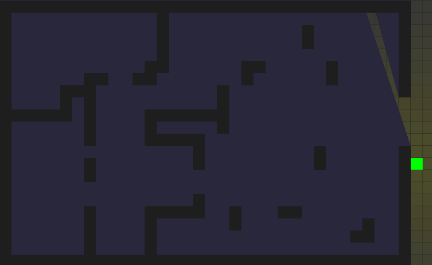

# slickman

A simple (and naive) implementation of 2D lighting using Slick2D library.
Inspired by an article about ray casting from Red Blob Games: https://www.redblobgames.com/articles/visibility/

Instructions for configuration for Maven:

**1)** Maven parameters for command line: `install exec:java`.

**2)** In IDEA: Run/Debug Configurations > Runner > VM Options > `-Djava.library.path=target/natives`.

**3)** In IDEA: File > Project Structure > Modules > Language level 8 & mark source and resource paths in the same menu.
